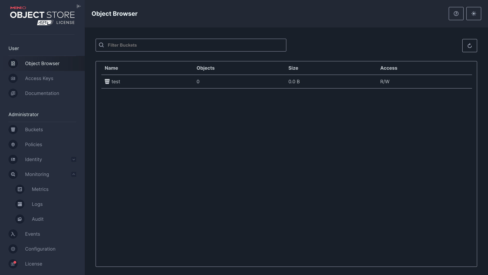
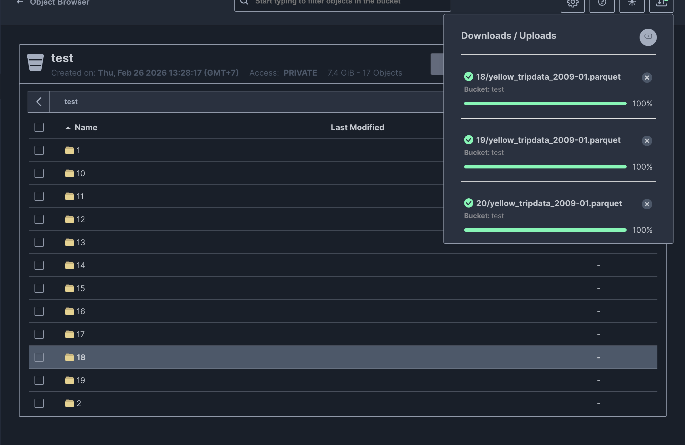
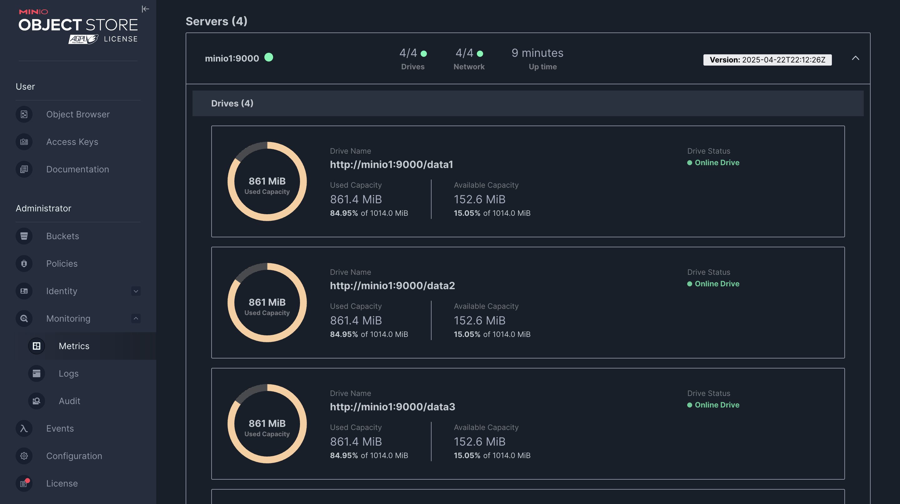
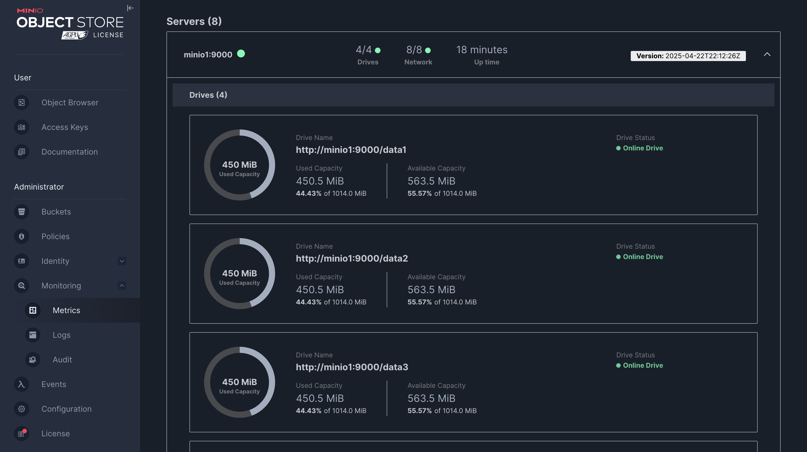
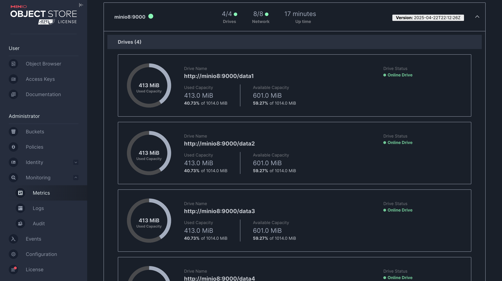

# MinIO Scale Cluster & Rebalance Demo

Demo for deploying a MinIO cluster with Vagrant, scaling from 4 nodes to 8 nodes, and performing a data rebalance.

## Requirements

- Vagrant + VirtualBox
- Docker (inside the VMs)

## 1. Start Vagrant VMs

**VM details:**

| Info        | Value                    |
|------------|---------------------------|
| VM IPs     | 172.16.16.101 – 172.16.16.108 |
| User       | `root`                    |
| Password   | `admin`                   |

```bash
vagrant up
```

SSH into the first node:

```bash
ssh root@172.16.16.101
```

On first connection, accept the fingerprint (type `yes`) and enter password: `admin`.

### Check disks on the VM

```bash
lsblk
```

Disks `/data1`–`/data4` (sdb–sde) will be used for MinIO.

### Docker Compose config file

Path: `/root/minio/docker-compose.yaml`. Sample content:

```yaml
services:
  minio1:
    hostname: minio1
    container_name: minio1
    image: quay.io/minio/minio:RELEASE.2025-04-22T22-12-26Z
    command: server --console-address ":9001" http://minio{1...4}/data{1...4}
    # command: server --console-address ":9001" http://minio{1...4}/data{1...4} http://minio{5...8}/data{1...4}
    ports:
      - "9000:9000"
      - "9001:9001"
    extra_hosts:
      - "minio1:172.16.16.101"
      - "minio2:172.16.16.102"
      - "minio3:172.16.16.103"
      - "minio4:172.16.16.104"
      - "minio5:172.16.16.105"
      - "minio6:172.16.16.106"
      - "minio7:172.16.16.107"
      - "minio8:172.16.16.108"
    environment:
      MINIO_ROOT_USER: admin
      MINIO_ROOT_PASSWORD: password
    volumes:
      - /data1:/data1
      - /data2:/data2
      - /data3:/data3
      - /data4:/data4
    healthcheck:
      test: ["CMD", "curl", "-f", "http://localhost:9000/minio/health/live"]
      interval: 30s
      timeout: 20s
      retries: 3
```

---

## 2. Start the MinIO cluster (minio1 – minio4)

On **each** node minio1, minio2, minio3, minio4:

```bash
cd ~/minio
docker compose up -d
```

### MinIO Console

| Node   | Console URL              |
|--------|--------------------------|
| minio1 | http://172.16.16.101:9001/ |
| minio2 | http://172.16.16.102:9001/ |
| minio3 | http://172.16.16.103:9001/ |
| minio4 | http://172.16.16.104:9001/ |

- **User:** `admin`
- **Password:** `password`



### Upload test file

- **Sample file URL:** https://d37ci6vzurychx.cloudfront.net/trip-data/yellow_tripdata_2009-01.parquet  

Upload this file to bucket `test` with the following prefixes (to create enough test data):

- `1/yellow_tripdata_2009-01.parquet`
- `2/yellow_tripdata_2009-01.parquet`
- `3/yellow_tripdata_2009-01.parquet`
- … (same for 4–20)

That is 20 objects: `1/` … `20/` in bucket `test`.



### Check capacity

Open: http://172.16.16.101:9001/tools/metrics  

Example **Used Capacity** after upload: ~861.4 MiB (~84.95% of 1.0 GiB).



---

## 3. Scale the cluster (minio1 – minio8)

Edit `docker-compose.yaml` on **all** 8 nodes (minio1–minio8).

**Change the `command` line:**

From:

```yaml
command: server --console-address ":9001" http://minio{1...4}/data{1...4}
# command: server --console-address ":9001" http://minio{1...4}/data{1...4} http://minio{5...8}/data{1...4}
```

To:

```yaml
# command: server --console-address ":9001" http://minio{1...4}/data{1...4}
command: server --console-address ":9001" http://minio{1...4}/data{1...4} http://minio{5...8}/data{1...4}
```

### Apply on each node

**minio1 – minio4:** remove the old container and start again:

```bash
cd ~/minio
vi docker-compose.yaml   # edit command as above
docker rm -f minio1      # replace minio1 with minio2, minio3, minio4 as appropriate
docker compose up -d
```

**minio5 – minio8:** edit the file then restart:

```bash
cd ~/minio
vi docker-compose.yaml
docker compose restart
docker compose up -d
```

### Verify after scaling

Open again: http://172.16.16.101:9001/tools/metrics  

The cluster will show **8 servers / 32 drives**.  

Note: MinIO **does not rebalance automatically**. Existing data stays on nodes 1–4; nodes 5–8 have lower usage (e.g. nodes 1–4: ~664.1 MiB, nodes 5–8: ~103.7 MiB). Run rebalance manually (step 4).

---

## 4. Rebalance the cluster

Install/use MinIO Client (`mc`), set an alias, and run rebalance.

Inside the minio1 container:

```bash
docker exec -it minio1 bash
```

Inside the container:

```bash
mc alias set minio http://minio1:9000 admin password

mc ls minio/test
mc ls minio/test/1

mc admin rebalance start minio
mc admin rebalance status minio
```

Example output while rebalance is in progress:

```
Per-pool usage:
┌──────────┬────────┐
│ Pool-0   │ Pool-1 │
│ 81.26% * │ 5.87%  │
└──────────┴────────┘
Summary:
Data: 0 B (0 objects, 0 versions)
Time: 14.155991929s (0s to completion)
```

After rebalance completes, usage is balanced across pools:

```
Per-pool usage:
┌────────┬────────┐
│ Pool-0 │ Pool-1 │
│ 61.00% │ 40.73% │
└────────┴────────┘
Summary:
Data: 5.8 GiB (10 objects, 10 versions)
Time: 4m1.922025611s (0s to completion)
```





## Summary

| Step | Description |
|------|-------------|
| 1 | `vagrant up` → SSH to 172.16.16.101 (root/admin) |
| 2 | On minio1–4: `cd ~/minio && docker compose up -d` |
| 3 | Upload test file to bucket `test`, check metrics |
| 4 | Edit `command` in docker-compose on all 8 nodes, restart/up |
| 5 | Run `mc admin rebalance start minio` to rebalance data |
